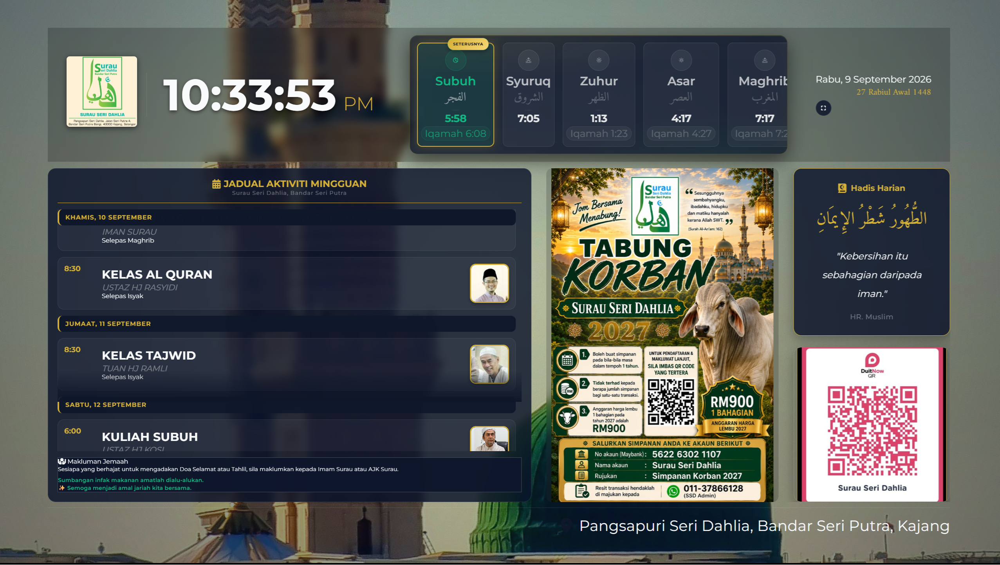

# 🕌 Surau Digital Display System (Firebase Edition)



A **modern, elegant, and dynamic digital display** for surau & masjid — featuring **live prayer times, automated countdowns, Islamic dates, and real-time activity management** powered by Firebase.

Designed for **Surau Seri Dahlia, Bandar Seri Putra**, with a TV-friendly "glassmorphism" interface.

---

## ✨ Features

✅ **Live Digital Clock** – Automated 12-hour format with seconds.  
✅ **Automated Prayer Times** – Real-time sync with JAKIM Malaysia zones via API.  
✅ **Dynamic Activity Board** – Manage weekly activities via Firebase (Firestore).  
✅ **Automatic Countdown** – Live timer to the next prayer / Iqamah.  
✅ **Gregorian & Hijri Calendars** – Automatic daily updates.  
✅ **Advertisement Carousel** – Rotating community announcements and support messages.  
✅ **Glassmorphism UI** – Optimized for clear visibility on large TV screens.  
✅ **Web-Based Admin** – Add activities remotely without touching code.

---

## 🏗️ Tech Stack

| Technology | Purpose |
|----------|--------|
| **HTML5 / CSS3** | Structure & Modern UI (Glassmorphism) |
| **JavaScript (ES6+)** | Frontend logic & dynamic rendering |
| **Firebase Firestore** | Real-time database for activities |
| **Firebase Auth** | Secure access for management |
| **Waktu Solat API** | Official Malaysia prayer times data |
| **Font Awesome** | Specialized Islamic & UI icons |

---

## 📁 Project Structure

```text
surau-display-firebase/
│
├── index.html           # Main TV display dashboard
├── activity_form.html    # Web form to add/update activities
│
├── js/
│   ├── firebase.js       # Firebase SDK initialization & config
│   ├── script.js         # Core display logic & Firestore sync
│   └── activity_form.js  # Logic for the activity management form
│
├── css/
│   ├── style.css         # Dashboard styling
│   └── activity_form.css # Form styling
│
└── img/
    ├── logo.jpg          # Surau official logo
    └── ustaz/            # Image assets for speakers
```

---

## 🚀 Getting Started

### 1. Firebase Setup
To use the dynamic activity feature, you need to connect your Firebase project:

1. Create a project at [Firebase Console](https://console.firebase.google.com/).
2. Enable **Firestore Database** and **Authentication**.
3. Create a `.env` or edit `js/firebase.js` with your credentials:

```javascript
const firebaseConfig = {
  apiKey: "YOUR_API_KEY",
  authDomain: "YOUR_AUTH_DOMAIN",
  projectId: "YOUR_PROJECT_ID",
  // ... rest of your config
};
```

### 2. Configure Prayer Zone
Open `js/script.js` and set your JAKIM zone:
```javascript
const CONFIG = {
  zone: 'SGR01', // Example: Hulu Langat
  location: 'Bandar Seri Putra',
};
```

---

## 📺 Deployment

### Smart TV / Mini PC
1. Host the files on **Firebase Hosting** (recommended) or any static web host.
2. Open the URL in the TV browser.
3. Press **F11** or enter **Kiosk Mode** for a full-screen experience.

### Remote Updates
Use `activity_form.html` from any mobile device or PC to update the jadual (schedule). Changes will reflect on the TV display **instantly** via Firestore's real-time listeners.

---

## 🧘 Design Philosophy

Built to be **distraction-free**, **elder-friendly**, and **aesthetically pleasing**. The interface transitions smoothly between day and night, ensuring high legibility from a distance.

---

## 📜 License
MIT License

## 🕌 Credits
Built with ❤️ for the community.
Inspired by the needs of **Surau Seri Dahlia**.

⭐ **Support the Project** – Share it with other masjid committees!
